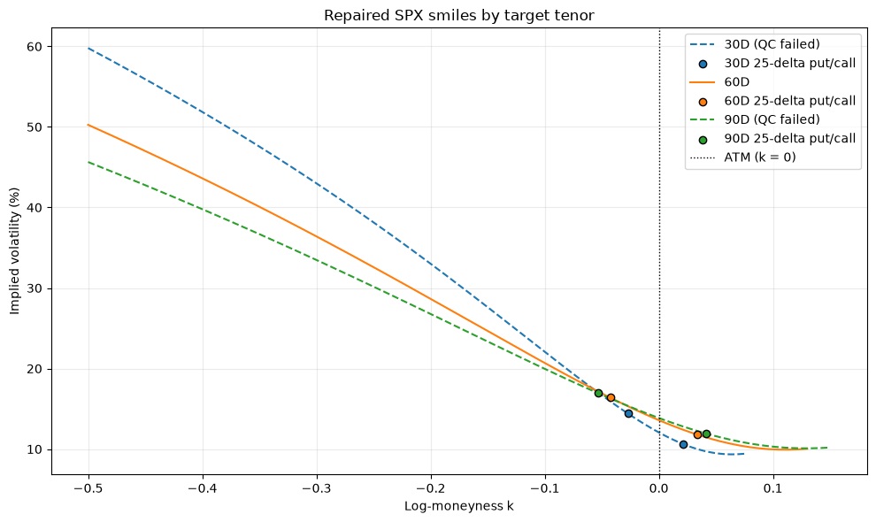
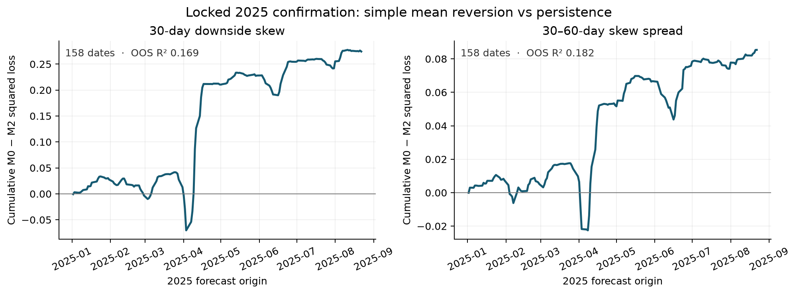
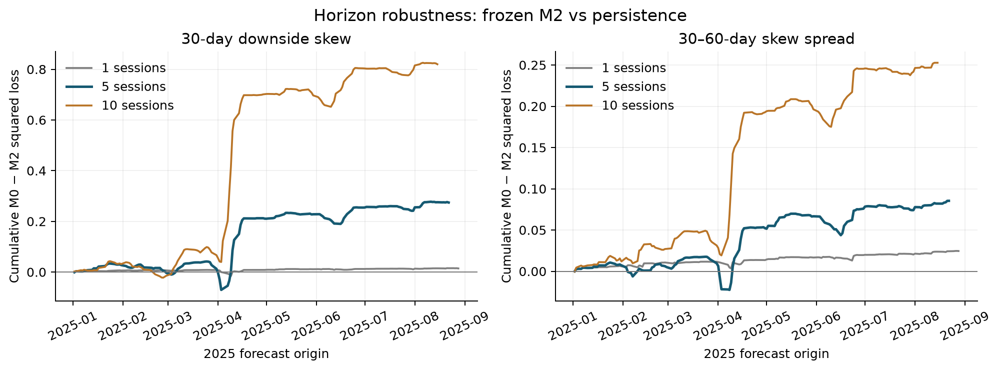

# SPX Volatility Surface Forecasting

From **14,726,287 OptionMetrics SPX quotes across 667 sessions** (2023-01-03–2025-08-29), this project builds fixed-tenor skew states and tests five-session forecasts. Evaluation is chronological: 2023–2024 development, then locked 2025 temporal confirmation. Proprietary data is excluded from the repository.

## Research question

Can surface and market state forecast SPX downside-skew changes, and do richer models beat simple mean reversion? The two pre-declared five-session targets are

$$
y^{30}_{t,5}=S^{30}_{t+5}-S^{30}_t,
\qquad
y^{\mathrm{spread}}_{t,5}=(S^{30}-S^{60})_{t+5}-(S^{30}-S^{60})_t.
$$

Here $S^j$ is the QC-approved $j$-day ATM downside-skew slope. The spread is a relative-value *forecasting* target, not a demonstrated trade.

## From quotes to surface states

The pipeline validates SPX identities, keeps PM-settled contracts, drops crossed quotes, matches calls and puts, infers forwards/discount factors by parity, and inverts midpoint IV. On 14–180 DTE expiries it fits **arbitrage-aware Raw SVI per expiry**, then applies support-aware calendar repair in total variance. Interpolation produces 30D/60D/90D ATM IV, downside-skew slope, and 25-delta RR, with metric-specific QC. Not every raw quote or fitted slice survives. The SSVI notebooks are exploratory; **Raw SVI plus calendar repair is the production surface**.

With $k=\log(K/F)$, the primary skew measure is $-\partial\sigma_{\mathrm{IV}}/\partial k$ near ATM (positive for conventional SPX downside skew). The RR25 alternative is 25-delta put IV minus 25-delta call IV.



*Existing 2025-08-29 diagnostic, not a historical-batch acceptance result. Dashed 30D/90D curves fail full-smile QC; ATM and 25-delta metrics have separate checks. This is not a proof of global arbitrage freedom.*

## Forecast design

Development uses expanding pseudo-OOS forecasts after **252 prior SPX sessions**. A label from origin $i$ trains a forecast at $t$ only if $i+h\leq t$. Horizons use the uncompressed SPX calendar; z-scores use earlier valid states after a fixed 60-observation warm-up. No random splits or surface forward-fill; headline models share scored dates. Development-selected models were frozen for **2025-01-02–2025-08-29** confirmation (158 common scored dates). Five-session targets overlap.

| Model | Pre-specified role |
| --- | --- |
| M0 / M1 | Zero-change persistence / historical mean change |
| M2 / M3 | Own-state mean reversion / plus recent own change |
| M4 | Add surface-state levels and term spreads |
| M5a / M5b | Add SPX returns and realised volatility / then VIX |
| M6 / M7 | Regularised Elastic Net / shallow histogram boosting |

Full feature sets, chronological validation, purging, and scoring rules are in the [frozen protocol](docs/forecasts.md).

## Locked 2025 results

| Five-session target | Persistence RMSE | Frozen M2 RMSE | M2 OOS $R^2$ vs persistence | Development-selected M6 RMSE |
| --- | ---: | ---: | ---: | ---: |
| 30D downside-skew change | 0.1012 | **0.0922** | 0.1695 | 0.1081 |
| 30D–60D skew-spread change | 0.0544 | **0.0492** | 0.1824 | — |

For the spread, frozen M2 correlation is **0.5619** and directional accuracy **0.6203**. Mean reversion improved locked-period forecast error over persistence.



*Positive cumulative M0-minus-M2 squared loss favours M2 on the same 158 scored 2025 dates. The failed M6 result remains in the locked-confirmation notebook.*

### What failed

The development-selected 30D Elastic Net (M6) **failed confirmation** (OOS $R^2$ versus M2: **−0.3731**). Richer models did not robustly displace M2 for the spread in development. No post-result retuning occurred.

## Post-confirmation robustness

Frozen M2 slopes are negative at 1D, 5D and 10D. OOS $R^2$ versus persistence is approximately **0.037 / 0.169 / 0.288** for outright skew and **0.106 / 0.182 / 0.317** for the spread. The 5D RR25-spread alternative has $R^2\approx0.225$; M2 beats persistence on all five fixed, non-overlapping origin offsets for both headline targets.

Two outlier diagnostics retain positive M2 gains. The **development-fixed extreme-move threshold** removes 5 outright and 1 spread observation ($R^2=0.255$ and $0.204$). The separate, outcome-based **confirmation top-1%-removed diagnostic** removes exactly 2 of 158 per target ($R^2=0.148$ and $0.168$): post-confirmation analysis, **not an untouched test**. Neither alters the headline.

Gains are near zero below VIX 20 and larger at/above 20: descriptive, **not** a fitted regime rule. Fixed-lag-4 Newey–West 95% intervals for mean squared-error gain include zero for both targets. The limited, overlapping sample does **not** establish a precise positive average loss gain or trading profitability.



*Each horizon has a different target and sample; vertical squared-error magnitudes are not directly scale-neutral.*

## Code and reproduction

| Location | Purpose |
| --- | --- |
| `src/historical_pipeline.py`, `src/raw_svi.py`, `src/vol_surface.py`, `src/skew_metrics.py` | Daily quote-to-surface processing and metric QC |
| `src/forecasting.py`, `src/forecast_robustness.py` | Frozen forecasting and post-confirmation checks |
| `notebooks/forecast_baselines.ipynb`, `forecast_linear_models.ipynb`, `forecast_ml_models.ipynb` | Development model ladder |
| `notebooks/forecast_locked_2025.ipynb`, `forecast_robustness.ipynb` | Locked confirmation and subsequent robustness |
| `docs/forecasts.md`, `docs/historical_processing.md`, `docs/progress.md` | Protocol, processing details, and research record |

With licensed OptionMetrics files available locally, from the repository root:

```bash
python3 -m venv .venv
source .venv/bin/activate
pip install -r requirements.txt
pytest
python -m src.historical_pipeline
```

The pipeline expects `data/raw/spx_option_prices_2023.csv`, `..._2024.csv`, and `..._2025.csv`. Forecast notebooks also need local `data/raw/spx_security_prices.csv` and `data/raw/VIX_security_prices.csv`. Processed CSVs and raw extracts are **gitignored and not redistributable**. With those data in place, run the notebooks in the order shown above; static README figures can be regenerated with `MPLBACKEND=Agg python -m scripts.export_readme_figures`. See [historical processing](docs/historical_processing.md) for resumability and outputs.

## Limits

Only 2023–August 2025 is processed, with 158 common scored confirmation dates. Earlier descriptive EDA included 2025: this is **locked temporal confirmation**, not a pristine unseen holdout. Older regimes would strengthen the assessment. There is no execution-cost-aware options P&L; the VIX split must not become a post-hoc trading rule.
